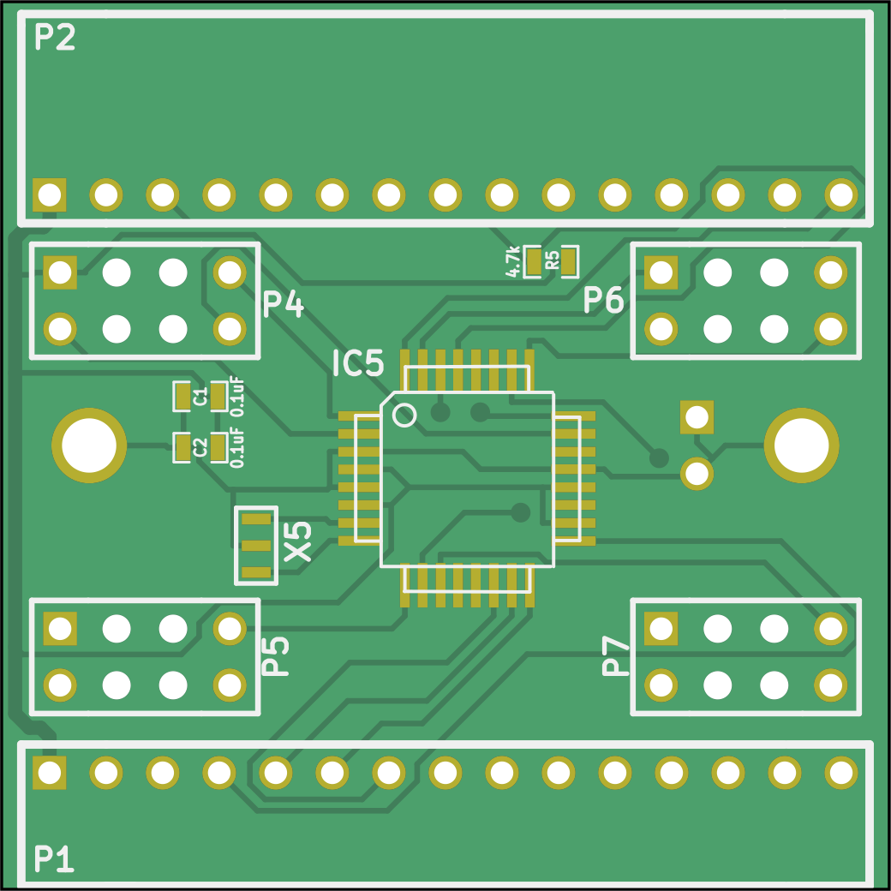
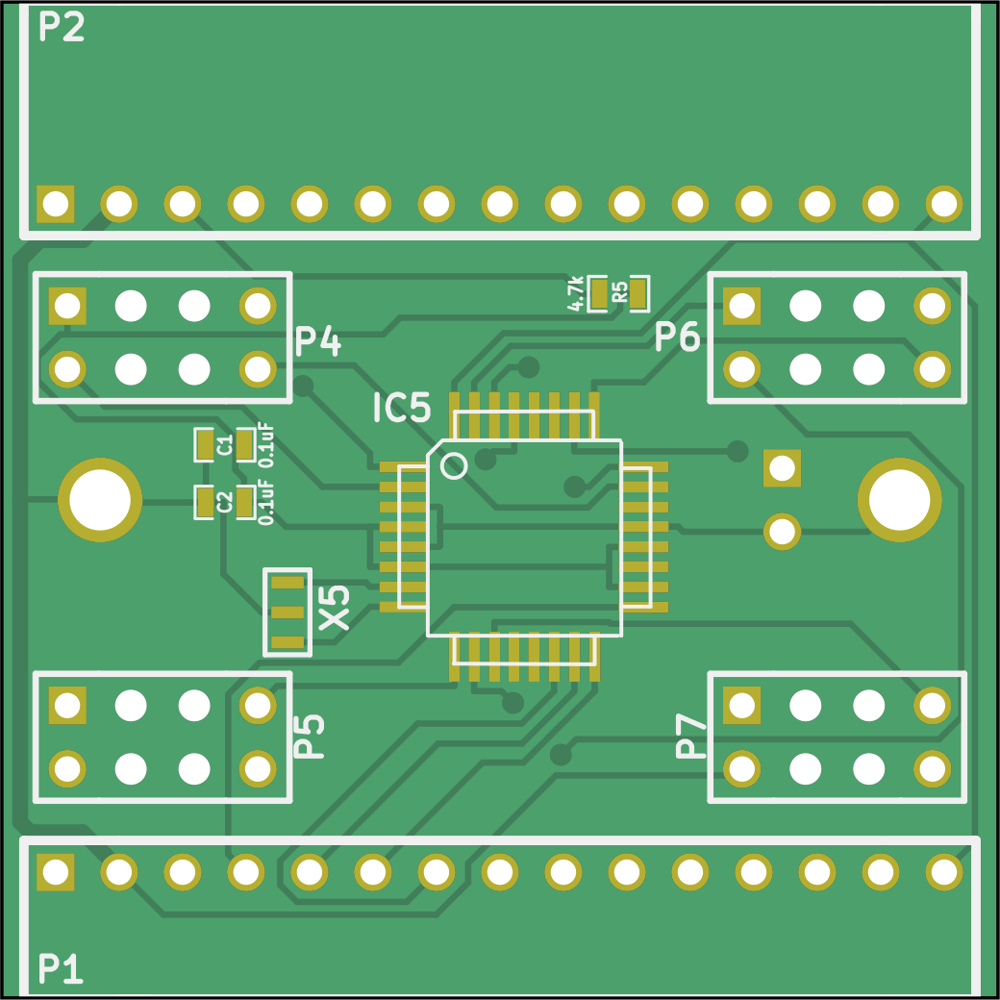

1. TOC
{:toc}

# Communication PCB

The communication PCB or "comm board" measures 40×40mm² and has a 15-pin connector on the bottom and a matching socket on the top edge. In addition, there are four 4×4 female sockets ([v0.3](#comm-v0p3)) or two 3×6 male pins ([v0.1](#comm-v0p1)) on the top side of the PCB. This board extracts data packets for the current panel from the SPI stream and sends them via I²C to the driver board. The connectors must always be connected to either an adjacent comm board or an arena.

{:standalone .ifr}

To identify packets for the current panel, each comm board uses four of its connectors as "chip select" lines. While the first chip select line is active, the comm board splits and forwards the received data to the driver board. Independently, the data is always forwarded to the next panel. In addition, the comm board drops the first chip select line from the input and promotes the remaining lines: the second input chip select line becomes the first output, the third becomes the second, and the fourth becomes the third output. This way, up to eight stacked panel PCBs can be addressed individually.

While the chip select line is active for the current panel, a microcontroller unit (MCU) splits the incoming signal into smaller chunks. The driver boards are divided into quadrants, and the comm board forwards the matching data packets to the quadrants via I²C bus. The protocol change has historic reasons: since [comm boards v0.3](#comm-v0p3), we use four connectors for the driver board; earlier versions had only two.

## Panel Comm PCB v0.6 {#comm-v0p6}

The comm board v0.6 represents a significant redesign of the communication board, moving from a 2-layer to a 4-layer PCB with improved signal integrity and power distribution. This version measures 40×40mm² and maintains full compatibility with the standard connector layout while providing enhanced electrical stability for more reliable operation, particularly in larger arena configurations. This version replaces the long-standing v0.3 design.

### Key Improvements

The v0.6 design addresses electrical stability issues identified in earlier versions:

- **4-layer stackup**: Signal+Power, Ground, Ground, Signal+Power layers for improved electrical performance and significantly reduced noise
- **Enhanced power distribution**: Dedicated power planes provide more stable voltage regulation across the board
- **Improved signal integrity**: Better impedance control and reduced crosstalk between signal lines
- **Updated microcontroller**: Uses a more readily available ATmega328P package, replacing the ATmega328P-AUR used in v0.3 which had limited availability
- **Additional chip select line**: Pin 14 now supports CS7 (previously not connected)

### Design

The KiCad design files are located in the `comm_v0p6` folder. Multiple production revisions are available in the `comm_v0p6/production/` directory (rev1, rev2, rev3), with the most recent being rev3. The board uses surface-mount components and follows modern design practices for signal integrity.

### Production

This design has been successfully manufactured in several iterations at [JLCPCB](https://jlcpcb.com/). The production files in the `comm_v0p6/production/` directory are proven designs that have been fabricated and assembled without issues.

This version is recommended for new builds requiring improved electrical stability and noise immunity, particularly for large arena configurations or applications sensitive to electrical interference.

## Panel Window PCB {#window}

{:standalone .ifr .clear data-img-class="pop"}

This PCB acts as a drop-in replacement for panels within a column. It has a cutout of 35×21mm² that allows you to point a camera or other device through that column. In most cases this is not needed, yet it is the simplest and least expensive PCB you can produce from the G4 system. If you have not had any experience with the process of ordering PCBs, you might want to start here. Before version v0.3, this was called "placeholder".

{:standalone .ifr .clear data-img-class="pop"}

If you want to skip a panel within a column, you will need to connect the chip select lines accordingly. The image on the right shows which input and output connectors you want to connect. Note that the signal travels from bottom to top. This has often been done with wires.

Alternatively, you can use the window PCB to achieve the same result. The PCB has the same outer dimensions and connectors as the comm PCB and provides the wiring described above between input and output.

{:.ifr .pop .clear}

{:standalone .ifr .clear data-img-class="pop"}

The KiCad design files for this simple 2-layer PCB are in the folder `comm_placeholder_v0`. The production-ready files are in the `comm_placeholder_v0/production_v0` folder. The most recent version, `comm_placeholder_v0p3.zip`, uses length-matched traces. All you need to order this design is the zip file, which contains the relevant files from the directory; most manufacturers will accept it. We have ordered this exact design from [OSHPark](https://oshpark.com/) with a quick turnaround time of around 5 days and a total cost of $10 per board, including components. With sufficient lead time, higher quantities, and other manufacturers, the price should be around $1 per unit. For example, in October 2020, an order of 30 window PCBs from [JLCPCB](https://jlcpcb.com/) cost less than $20 including shipping and was delivered within 14 days.

The window PCB may be a good starting point to familiarize yourself with file types, the organization of our repositories, and the production process if you have never done this before. Otherwise, please excuse the detailed information in the text above.

# Connections

The bottom pins have the following assignments, viewed from the direction of the driver:

| No | Name           | Description  |
| --:|:---------------|:-------------|
|  1 | `5VCC`         | (5V Power) |
|  2 | `GND`          | (Ground) |
|  3 | `RESET_MAIN`   | (Reset all panels) |
|  4 | `SCK`          | (Serial Clock) |
|  5 | `COPI`         | (Controller Out, Peripheral In) |
|  6 | `CIPO`         | (Controller In, Peripheral Out) |
|  7 | `CS0`          | (Chip Select 0) |
|  8 | `CS1`          | (Chip Select 1) |
|  9 | `CS2`          | (Chip Select 2) |
| 10 | `CS3`          | (Chip Select 3) |
| 11 | `CS4`          | (Chip Select 4) |
| 12 | `CS5`          | (Chip Select 5) |
| 13 | `CS6`          | (Chip Select 6) |
| 14 | `NC`, `CS7     | (Not Connected) [<v0.6], (Chip Select 7) |
| 15 | `EXT_INTO`     |  |

Here, `SCK`, `COPI`, `CIPO`, and `CSx` are used for the SPI communication. `RESET_MAIN` sends a reset signal to all MCUs.

# Historic designs

These designs are preserved for historical reference and for debugging existing systems. If you have one of these boards, you likely know what to do and simply need the design files. If you are building a new system, do not use these versions.

## Panel Comm PCB v0.3 {#comm-v0p3}

{:.ifr .pop}

{:standalone .ifr .clear data-img-class="pop"}

The communication board v0.3 is a 40×40mm² PCB with two layers, available in `comm_v0p3` (see [schematic](assets/comm_v0p3_schematic.pdf)). This version was produced for the longest time and has been used successfully across many arena setups before being replaced by [v0.6](#comm-v0p6). The connectors are through-hole; other components are surface-mount devices (SMD).

### Function

The comm board v0.3 receives signals (P1) and forwards them (P2). Based on the chip select line, it identifies the signals relevant for the current panel. This processing is performed by a 20MHz ATmega328P-AUR (IC5). The relevant signals are passed to one of the four driver board quadrants (P4–P7).

### Design

The design files are in the `comm_v0p3` folder, and the production files are in the `comm_v0p3/production_v0/` directory.

The design files are shared under a Creative Commons license as [KiCad](https://kicad-pcb.org/) EDA source files. They were initially developed by [IO Rodeo](https://iorodeo.com). If you open the schematics in a current version of KiCad, you may be asked to remap the symbols when you first open the files.

### Production

{:standalone .ifr .clear data-img-class="pop"}

The comm board v0.3 is a two-layer PCB with 1oz copper that has no special production requirements. We typically order them on standard FR-4 substrate. The board has through-hole components such as the connectors, but the majority of components are SMD with the smallest package size of 0603 (imperial) or 1608 (metric).

For an order volume of 150 pieces, we would expect prices around $16 per assembled board. This breaks down to approximately $1.50 for the board, $8 for the components, $6 for assembly, and $0.50 for shipping. We have had good experiences with [Bittele](https://www.7pcb.com/). If you order from Bittele, you can provide quotation Q70762A1 and order number 39493C2 as references for successful builds.

## Panel Comm PCB v0.2 {#comm-v0p2}

{:.ifr .pop}

{:standalone .ifr .clear data-img-class="pop"}

In theory, v0.2 should have a 2×3 pin connector that was used briefly in certain drivers. The actual comm board with the 2×3 connector appears to be lost, so we are currently uncertain about the exact specifications of version 0.2. If you want to examine the [schematic](assets/comm_v0p2_schematic.pdf), the project files are available in `comm_v0p2`.

Everything else regarding design and production is very similar to [comm board v0.3](#comm-v0p3). There is no reason to build a comm board v0.2, except perhaps to replace a broken one. Even then, you should consider upgrading your hardware instead, especially given the uncertain history of this version.

The original documentation for v0.2 contained hints that the communication was changed from I²C to SPI and that the board-to-board headers were improved.

## Panel Comm PCB v0.1
{:.clear #comm-v0p1}

{:.ifr .pop}

{:standalone .ifr .clear data-img-class="pop"}

{:standalone .ifr .clear data-img-class="pop"}

The `comm_v0p1` folder contains an earlier comm board project (see [schematic](assets/comm_v0p1_schematic.pdf)). This version uses a different communication protocol and is not compatible with driver v0.2 and later. The files are available should you need to repair an existing system with [driver v0.1]({{site.baseurl}}/Generation%204/Panel/docs/driver.html#driver-v0p1).
