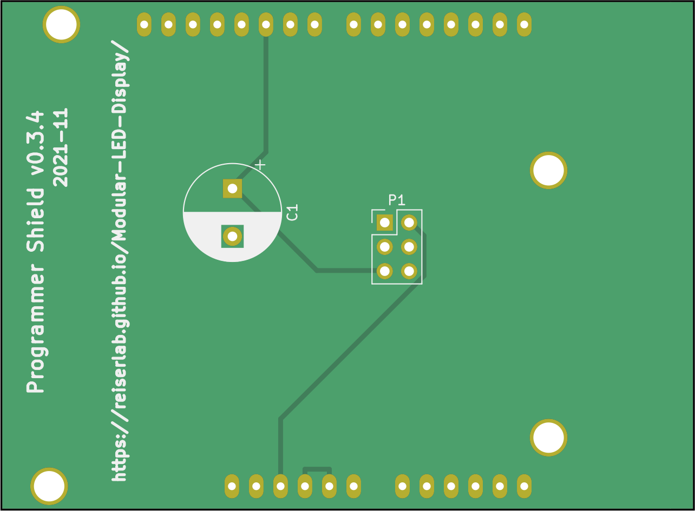
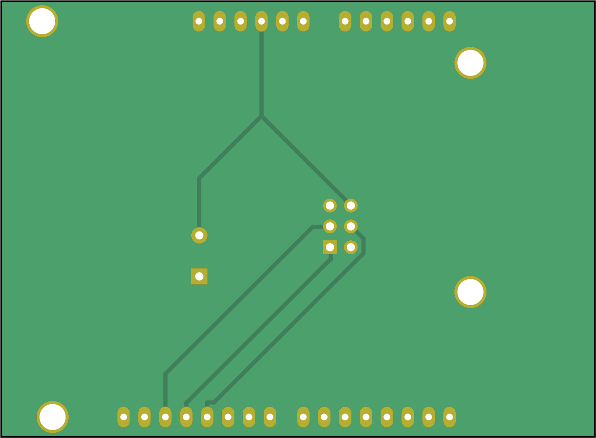
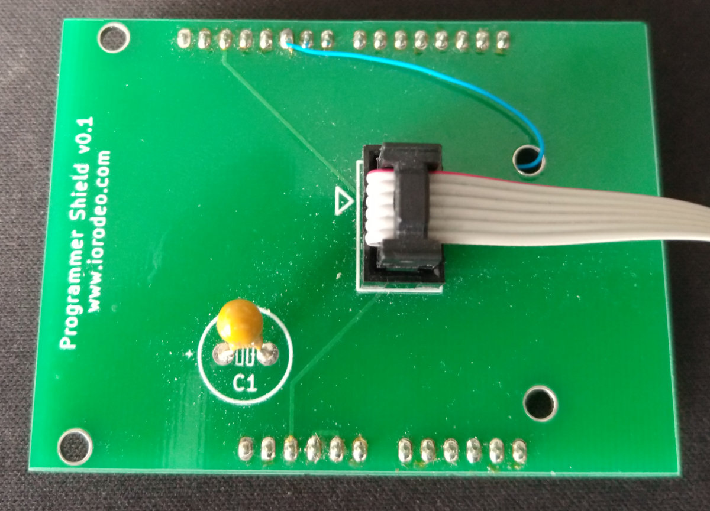
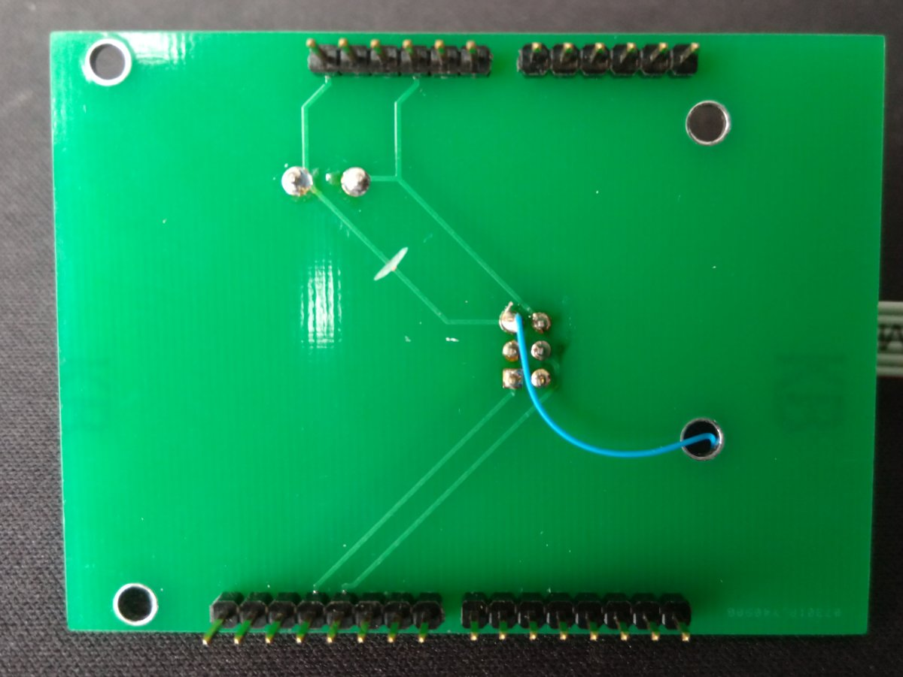
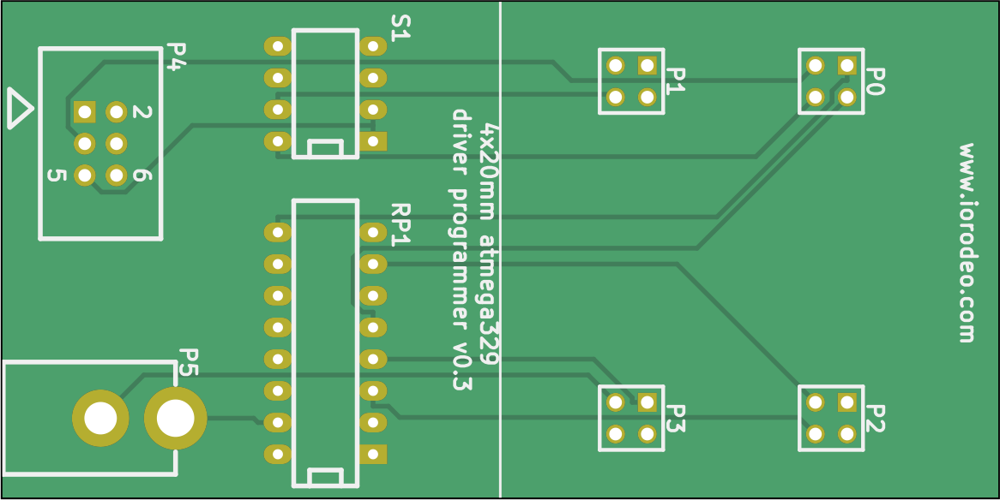
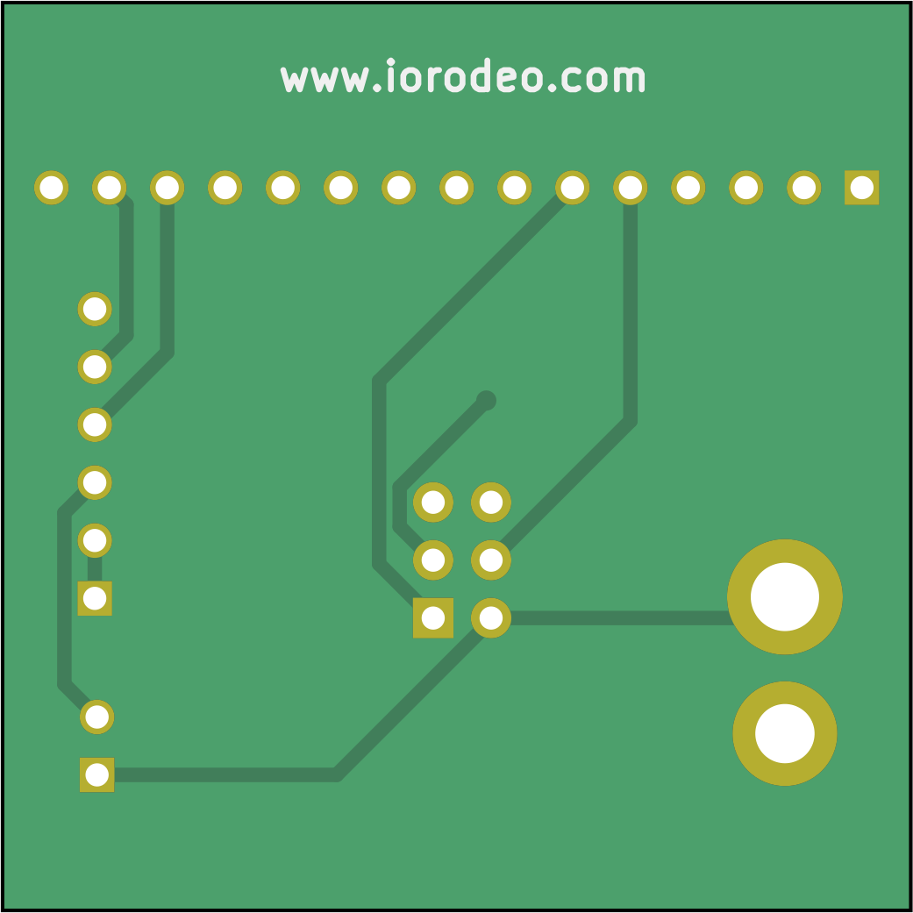

1. TOC
{:toc}

# Programmer

The programmer is built from 3 PCB: An Arduino shield, the comm programmer, and the driver programmer. The three boards are designed to be assembled by hand: These simple 2-layer boards use very few through-hole components and only one of each board is needed for the setup of an arena.

The use of the programmer is explained in more detail in the [Assembly → Firmware section]({{site.baseurl}}/Generation%204/Firmware/docs/), but the general principle is as follows: The Arduino shield needs to be mounted on an Arduino. The same shield can be used for programming the communication boards and the driver boards. Connect the corresponding programmer board via a ribbon cable to the Arduino shield, and the board you want to program to the programmer board.

## Arduino shield {#arduino-shield}

{:.ifr .pop}

{:standalone .ifr .clear data-img-class="pop"}

The Arduino programming shield measures 72.39×53.34mm². The gerber files and a drill file of the most recent version v0.3.4 (see [schematics](assets/shield_programmer_v0p3_schematic.pdf)) are archived in `shield_programmer_v0p3/production_v0/shield_programmer_v0p3r4.zip` but have never been produced. They should fix the issue mentioned in the _Quick Fix_ below. The most recent version that was produced is v0.3.1 in the same directory.

### Function of the Arduino shield

The basic functionality of the Arduino shield is to convert the signals from the Arduino connectors on the side the ribbon connector (P1).

### Quick Fix
{:.clear}

{:.ifr .pop}

{:standalone .ifr .clear data-img-class="pop"}

Apparently there is an error in the arduino shields prior to version v0.3.4 of the programmer. If you happen to have one of those programmers, please cut the trace on the bottom as shown in the image on the right and add a new connection as demonstrated in the two images. Alternatively you can try to produce v0.3.4 and [let us know]({{site.baseurl}}/Contact) how it worked.

## Driver board shield {#driver-shield}
{:#driver .clear}

{:.ifr .pop}

{:standalone .ifr .clear data-img-class="pop"}

The driver programmer has double the size of a panel board, it is 40×80mm².

The most recent version of the production files is version v0.3 in `shield_driver_v0p3/production_v0/shield_driver_v0p3.zip` (see [schematics](assets/shield_driver_v0p3_schematic.pdf). Once again this directory contains a zip file ready to be used with a manufacturer. The production files contain gerber files, a drill file, and a BOM.

### Function of the driver board shield

The shield adapts the signal from the ribbon connector (P4) to the four driver board connectors (P0…P3), while also powering the driver board during programming (P5). The switch (S1) allows to select which driver MCU will be programmed (usually all 4 are on).

## Comm board shield {#comm-shield}
{:#comm .clear}

{:.ifr .pop}

{:standalone .ifr .clear data-img-class="pop"}

With 40×40mm² the PCB for the communication board programmer has the same dimensions as a communication board or a driver board. The most recent KiCad design files are at `shield_comm_v0p3` (also see [schematics](assets/shield_comm_v0p3_schematic.pdf)).

Production files for the communication board programmer are available in version v0.3, also as a zip file at `shield_comm_v0p3/production_v0/shield_comm_v0p3.zip` ready for submission. The production files contain the gerber files, drill file, and a "Bill of Materials" (BOM) as an xlsx file (Office Open XML format used by Microsoft Office).

### Function of the comm board shield

The shield adapt the signal from the Arduino (P2) to the communication board connector (P3), while also powering the communication board during programming (P1).

# Design

These boards were initially developed by [IORodeo](https://iorodeo.com) in 2013 and shared under a creative commons license.
